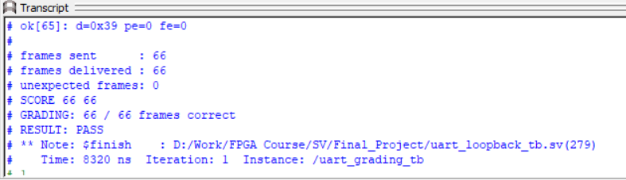

<div align="center">

# UART Transmitter / Receiver

**A SystemVerilog serial UART design, simulated and verified with ModelSim.**

</div>

---

## Results

All **66 / 66** grading tests pass:



---

## What is this project?

A simple **UART (Universal Asynchronous Receiver/Transmitter)** built in
SystemVerilog. The design has two halves:

- **Transmitter (`uart_tx.sv`)** — serializes a byte into a frame and pushes it
  onto the serial line, one bit per clock cycle.
- **Receiver (`uart_rx.sv`)** — watches the serial line, rebuilds the byte, and
  reports any parity or framing errors.

The two are wired together in a loopback testbench that sends many random bytes
and verifies the receiver delivers exactly what the transmitter sent.

---

## Frame format

Each frame is **11 bits**:

| Slot      | Meaning        |
|-----------|----------------|
| `0`       | Start bit (`0`) |
| `1..8`    | 8 data bits    |
| `9`       | Parity (even/odd) or stop |
| `10`      | Stop bit (`1`)  |

---

## Module structure

### Transmitter (`uart_tx.sv`)
- **`uart_fsm`** — control state machine (starts and tracks the frame).
- **`uart_paritycalc` / `FULLADDER`** — computes the even/odd parity bit.
- **`uart_serializer`** — 11-bit shift register that shifts one bit out per clock.

### Receiver (`uart_rx.sv`)
- **`edgeDetector`** — detects rising / falling edges on the serial line.
- **`sampler`** — captures one sample per clock into an 11-bit register.
- **`errorCheckerModule`** — extracts data and flags parity / framing errors.
- **`uart_rx_fsm`** — receiving state machine (`IDLE → DATA → PARITY → STOP`).
- **`uart_rx`** — top wrapper that ties everything together.

---

## Problems fixed

1. **Baud rate completely removed from the TX** — the pulse is driven directly
   by the system clock, so one bit is sent every cycle (no frequency divider).
2. **TX state machine delay removed** — the FSM previously took ~5 extra clocks
   before the start bit reached the wire, which failed tests 4 & 5. Its outputs
   are now combinational so transmission starts immediately.

---

## How to run

Use **ModelSim** from a shell in the `sim/` folder:

```powershell
vlog -work work "../uart_tx.sv" "../uart_rx.sv" "../uart_loopback_tb.sv"
echo "run 500us`nquit -f" | vsim -c -t 1ps uart_grading_tb
```

Expected final output:

```
frames sent      : 66
frames delivered : 66
unexpected frames: 0
SCORE 66 66
RESULT: PASS
```

---

## Files

| File                    | Description                          |
|-------------------------|--------------------------------------|
| `uart_tx.sv`            | UART transmitter design              |
| `uart_rx.sv`            | UART receiver design                 |
| `uart_loopback_tb.sv`   | Grading testbench (read-only)        |
| `assets/`               | Screenshots                          |

---

<div align="center">

Designed by **Mohamed Abdelhamid Ahmed Ali**  
Supervised by **Eng. Moaz Khaled**

</div>